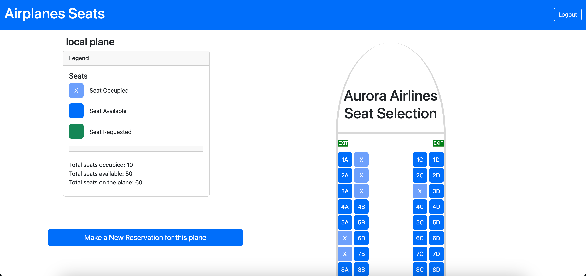

# Exam #2: "Airplanes Seats"

## Student: 1

## React Client Application Routes

- Route `/`: main page where user can choose the plane type to visualise
- Route `/local`: page containing the local plane view and its seats, a legend containing number of seats available, occupied and total, and reservation buttons.
- Route `/international`: page containing the local international view and its seats, a legend containing number of seats available, occupied and total, and reservation buttons.
- Route `/regional`: page containing the regional plane view and its seats, a legend containing number of seats available, occupied and total, and reservation buttons.
- Route `/login`: page containing the login form, user has to insert username and password. after authentication is complete, the user will be redirect to the main page.

## API Server

### User

- POST `/api/sessions`

  - request body: {username: "name", password: "password" }
  - save the user in the session and returns the info of the user (id,username,email), does NOT return password or salt.
- GET `/api/sessions/current`

  - request: Cookie: "...", body empty
  - returns the info of the user (id,username,email) saved in the session
- DELETE `/api/sessions/current`

  - request: Cookie: "...", body empty
  - response: body empty, remove user from the session

### Seats

- POST `/api/seats`: save an array of seats inside the database (only for authenticated)

  - request body: {"id":"1","type":"local","seats":[ "1A", ... ]}, Cookie: "..."
  - "ok"
- GET `/api/seats`: fetch all the seats reserved inside the database

  - request: Cookie: "..."
  - [ {"planeType":"regional","code":"4D","userID":4},{"planeType":"regional","code":"18C","userID":4},{"planeType":"regional","code":"2B","userID":4}, ... ]
- DELETE `/api/seats`: delete all the seats specified inside the array passed (only for authenticated)

  - request body: {"id":"1","type":"local","seats":["1A"]}, Cookie: "..."
  - "ok"

## Database Tables

1. ***Users***: Store information about registered users who can make reservations.
   * user_id (Primary Key)
   * username
   * password (encrypted)
   * email
   * salt
2. ***Seats***: Store information about reserved seats.
   * seat_id (Primary Key)
   * type (local,international, regional)
   * code (e.g., "10A")
   * user_id (Foreign Key referencing Users)

## Main React Components

- ***LoginForm*** (in *Auth-component.jsx*): manage the login of the user. it contains the form in which the user can insert its username and password.
- ***PlanesChoice*** (in *PlanesView-component.jsx*): manage the main page content in which the user can choose between the different plane types and its navigation.
- ***PlanesContent*** (in *PlanesView-component.jsx*): manage the page content for each type of plane, it contains the seat rows generation based on the type of plane chosen, plus the disposition of every component inside the page.
- ***ReservationButtons*** (in *Reservation-component.jsx*): manage all the buttons concerning the reservation. the user can choose through the buttons' logic,  whether to use the seats form or the seats selection.
- ***SeatsForm*** (in *Reservation-component.jsx*): manage the random seats selection, the form with number of seats to reserve in input.
- ***Seat*** (in *SeatManagement-component.jsx*): manage each single seat logic, its visual depending on its status.

## Screenshot

## Users Credentials

- *aurora, polito* (confirmed reservations on regional and international plane)
- *luigi, webapp* (without any reservation)
- *fulvio, webapp* (without any reservation)
- *passenger, password* (confirmed reservations on local and regional plane)
